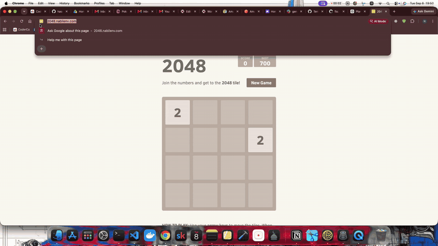
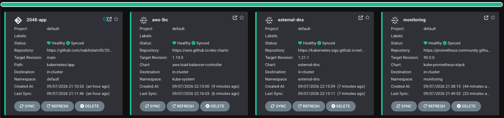
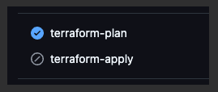
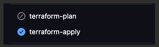

# 2048 on Amazon EKS


<p align="center">
  
</p>

---

## Table of Contents

- [Overview](#overview)
- [Platform Demo](#platform-demo)
- [Architecture Overview](#architecture-overview)
  - [Networking](#networking)
  - [Ingress](#ingress)
  - [Compute](#compute)
  - [Application](#application)
  - [DNS and TLS](#dns-and-tls)
  - [Container Registry](#container-registry)
- [Repository Structure](#repository-structure)
- [GitOps Workflow](#gitops-workflow)
- [CI/CD Pipelines](#cicd-pipelines)
  - [Terraform Pipeline](#terraform-pipeline)
  - [Application Release Pipeline](#application-release-pipeline)
- [Observability](#observability)
- [Security](#security)
- [Key Technical Decisions](#key-technical-decisions)
- [Known Limitations and Future Improvements](#known-limitations-and-future-improvements)
- [Quick Start](#quick-start)
- [Technologies Used](#technologies-used)

---

## Overview

This project deploys the 2048 web application to Amazon EKS and builds a complete delivery workflow around it.

The application is packaged into a Docker image and stored in Amazon ECR. Amazon EKS runs the workload on a managed node group inside private subnets, while an internet-facing Application Load Balancer exposes the application securely over HTTPS.

Terraform manages the AWS infrastructure. ArgoCD manages Kubernetes workloads using Git as the source of truth, while GitHub Actions provides two CI/CD workflows: one for infrastructure changes and another for application releases.

The application is available at:

**https://2048.nabilenv.com**

Cloudflare manages the DNS zone, ExternalDNS maintains the application DNS record, and AWS Certificate Manager provides the TLS certificate.

---

## Platform Demo

<p align="center">
  
</p>

---

## Architecture Overview

The platform runs in AWS `eu-west-2` across two Availability Zones using a custom VPC.

### Networking

- VPC: `10.0.0.0/16`
- Public subnet in `eu-west-2a`: `10.0.1.0/24`
- Public subnet in `eu-west-2b`: `10.0.2.0/24`
- Private subnet in `eu-west-2a`: `10.0.3.0/24`
- Private subnet in `eu-west-2b`: `10.0.4.0/24`
- EKS worker nodes run inside the private subnets
- The internet-facing Application Load Balancer spans the public networking layer

The VPC is split across two Availability Zones so the whole platform is not tied to a single failure domain.

### Ingress

- AWS Load Balancer Controller watches the Kubernetes Ingress resource
- An internet-facing Application Load Balancer is provisioned automatically
- The ALB uses IP targets
- HTTP port `80` redirects to HTTPS port `443`
- AWS Certificate Manager provides the TLS certificate for `2048.nabilenv.com`
- Traffic is routed from the ALB to the Kubernetes Service and application pods

> [!NOTE]
> ALB was used instead of introducing another ingress controller such as Traefik or ingress-nginx. The AWS Load Balancer Controller can translate the Kubernetes Ingress directly into an AWS Application Load Balancer, keeping the traffic path relatively simple:
>
> `Internet → ALB → Kubernetes Service → Pods`

### Compute

- Amazon EKS `1.34`
- EKS managed node group
- `t3.small` worker nodes
- `ON_DEMAND` capacity
- Minimum nodes: `1`
- Desired nodes: `3`
- Maximum nodes: `3`

Worker nodes run the application and supporting Kubernetes workloads including ArgoCD, ExternalDNS, AWS Load Balancer Controller and the monitoring stack.

> [!NOTE]
> The cluster originally ran with fewer worker nodes, but the monitoring stack increased pod density beyond what the existing `t3.small` nodes could accommodate. The desired node count was increased to three to provide enough capacity.


### Application

The 2048 application runs as a Kubernetes Deployment with two replicas.

```text
Replicas:        2
CPU request:     50m
CPU limit:       200m
Memory request:  64Mi
Memory limit:    128Mi
```

The Deployment is exposed internally through a ClusterIP Service.

A Kubernetes Ingress connects the application to the AWS Application Load Balancer.

The container image is stored in Amazon ECR under the `2048-app` repository.

Each application release uses the Git commit SHA as the image tag.

### DNS and TLS

Cloudflare manages DNS for:

```text
nabilenv.com
```

ExternalDNS watches the Kubernetes Ingress and automatically creates or updates the DNS record for:

```text
2048.nabilenv.com
```

AWS Certificate Manager provides the HTTPS certificate.

Certificate ownership is validated using a DNS CNAME record in Cloudflare.

The resulting request flow is:

```text
User
  ↓
Cloudflare DNS
  ↓
2048.nabilenv.com
  ↓
AWS Application Load Balancer
  ↓
Kubernetes Ingress
  ↓
app-2048 Service
  ↓
2048 Pods
```

> [!NOTE]
> Cloudflare was already managing the domain, so ExternalDNS was configured to work directly with Cloudflare rather than introducing Route 53 purely for this project.

### Container Registry

Amazon ECR stores the 2048 Docker images.

The application release pipeline builds the image, scans it using Trivy and only pushes it to ECR if the scan passes.

ECR is configured with:

- Image scanning enabled
- Immutable image tags

Using immutable tags prevents a previously scanned image version from being silently replaced.

---

## Repository Structure

```text
2048-eks-platform/
│
├── .github/
│   └── workflows/
│       ├── app-release.yml
│       └── terraform.yml
│
├── app/
│   ├── Dockerfile
│   ├── index.html
│   ├── js/
│   ├── style/
│   └── ...
│
├── kubernetes/
│   ├── app/
│   │   ├── deployment.yml
│   │   ├── ingress.yml
│   │   └── service.yml
│   │
│   ├── argocd/
│   │   ├── application.yml
│   │   ├── aws-lbc-app.yml
│   │   ├── external-dns-app.yml
│   │   └── monitoring-app.yml
│   │
│   ├── aws-load-balancer-controller/
│   │   ├── service-account.yml
│   │   └── values.yml
│   │
│   ├── external-dns/
│   │   └── values.yml
│   │
│   └── monitoring/
│       └── values.yml
│
├── terraform/
│   ├── bootstrap/
│   │   ├── main.tf
│   │   ├── variables.tf
│   │   └── ...
│   │
│   ├── environments/
│   │   └── dev/
│   │       ├── backend.tf
│   │       ├── main.tf
│   │       ├── outputs.tf
│   │       ├── variables.tf
│   │       └── versions.tf
│   │
│   └── modules/
│       ├── ecr/
│       ├── eks/
│       ├── iam/
│       └── vpc/
│
├── assets/
│   ├── 2048-eks-architecture.png
│   ├── 2048-live.png
│   ├── terraform-pipeline.png
│   └── grafana.png
│
├── .gitignore
└── README.md
```

Terraform is split into separate modules for the main infrastructure concerns rather than placing the entire platform into one large configuration.

---

## GitOps Workflow

ArgoCD manages the Kubernetes side of the platform.

The Git repository acts as the source of truth for the cluster configuration.

```text
GitHub Repository
       ↓
     ArgoCD
       ↓
   Amazon EKS
```

ArgoCD currently manages:

```text
2048-app
aws-lbc
external-dns
monitoring
```

Automated sync, pruning and self-healing are enabled.

This was tested by manually changing the number of replicas in the live cluster. ArgoCD detected that the live configuration no longer matched Git and restored the Deployment to the replica count stored in the repository.

The application release workflow also follows this GitOps model.

GitHub Actions does **not** deploy directly to Kubernetes.

Instead:

```text
Application change
      ↓
Docker image built
      ↓
Image scanned
      ↓
Image pushed to ECR
      ↓
deployment.yml updated
      ↓
Change committed to Git
      ↓
ArgoCD detects change
      ↓
EKS deployment updated
```

This keeps the version stored in Git aligned with the version ArgoCD expects to be running in the cluster.

<p align="center">
  
</p>
---

## CI/CD Pipelines

Two GitHub Actions workflows are used:

```text
.github/workflows/terraform.yml
.github/workflows/app-release.yml
```

Both authenticate to AWS using GitHub OIDC rather than stored long-lived AWS access keys.

### Terraform Pipeline

The Terraform workflow runs for changes under:

```text
terraform/**
```

#### Pull Request

For a pull request into `main`:

```text
Checkout
   ↓
AWS authentication using OIDC
   ↓
Terraform init
   ↓
Terraform validate
   ↓
Checkov security scan
   ↓
Terraform plan
```

No infrastructure changes are applied from a pull request.

> [!NOTE]
> Pull requests use a dedicated Terraform plan IAM role. This allows infrastructure changes to be reviewed without giving the PR workflow the same permissions used to modify AWS resources.

#### Push to Main

After Terraform changes reach `main`:

```text
Checkout
   ↓
AWS authentication using OIDC
   ↓
Terraform init
   ↓
Terraform validate
   ↓
Checkov security scan
   ↓
Terraform plan
   ↓
Terraform apply
```

The apply workflow uses a separate IAM role with the permissions required to manage the platform infrastructure.

<p align="center">
  
  
</p>

### Application Release Pipeline

The application workflow runs when files under:

```text
app/**
```

change on `main`.

It can also be triggered manually using `workflow_dispatch`.

The release process is:

```text
Checkout
   ↓
Assume AWS IAM role through OIDC
   ↓
Login to ECR
   ↓
Docker build
   ↓
Trivy security scan
   ↓
Push image to ECR
   ↓
Update kubernetes/app/deployment.yml
   ↓
Commit new image tag
   ↓
ArgoCD detects the change
   ↓
Deploy updated application
```

Trivy scans for:

```text
HIGH
CRITICAL
```

severity vulnerabilities.

The pipeline is configured to fail if relevant HIGH or CRITICAL findings are detected.

Each Docker image uses:

```text
github.sha
```

as its image tag.

This creates a direct link between the running container and the Git commit that produced it.

<p align="center">
  
</p>


## Observability

Monitoring is provided by:

```text
kube-prometheus-stack
```

and is deployed through ArgoCD.

The stack includes:

- Prometheus
- Grafana
- Alertmanager
- Node Exporter
- kube-state-metrics
- Kubernetes ServiceMonitors

Prometheus collects cluster and workload metrics.

Grafana provides dashboards covering areas such as:

- Cluster CPU and memory
- Worker node usage
- Pod resource consumption
- Kubernetes workloads
- API server
- Networking
- Kubelet
- Node metrics

Prometheus metrics are retained for:

```text
7 days
```

<p align="center">
  
</p>

Application resource requests and limits were also added to improve scheduling behaviour and make resource usage visible through the monitoring dashboards.

```text
CPU request:     50m
CPU limit:       200m

Memory request:  64Mi
Memory limit:    128Mi
```

---

## Security

Security controls are included across both the infrastructure and application delivery process.

### IAM and GitHub OIDC

GitHub Actions authenticates to AWS through OpenID Connect.

This removes the need to store permanent AWS access keys in GitHub.

Dedicated IAM roles are used for:

```text
Terraform plan
Terraform apply
Application release
```

The IAM trust policies restrict which GitHub repository is allowed to assume the roles.


### IRSA

AWS Load Balancer Controller uses IAM Roles for Service Accounts.

The Kubernetes service account is mapped to a dedicated AWS IAM role, allowing the controller to interact with AWS without storing AWS credentials inside the pod.

### Infrastructure Security Scanning

Checkov scans the Terraform configuration in both the plan and apply workflows.

The scan occurs before Terraform is allowed to continue.

This provides an additional check for infrastructure-as-code misconfigurations before resources are changed.

### Container Security Scanning

Trivy scans each application image before it is pushed to Amazon ECR.

The release pipeline checks for:

```text
HIGH
CRITICAL
```

severity findings.

Images that fail the configured scan policy are not pushed to ECR.

### Kubernetes Secrets

Sensitive values are not committed to Git.

Kubernetes Secrets are used for values such as:

```text
Cloudflare API token
Grafana administrator credentials
```

### KMS Encryption

Amazon EKS uses AWS KMS for encryption of Kubernetes secrets at rest.

---

## Key Technical Decisions

### ALB instead of NLB and Traefik

The AWS Load Balancer Controller provisions an Application Load Balancer directly from the Kubernetes Ingress resource.

The application traffic path is:

```text
User
  ↓
Cloudflare
  ↓
Application Load Balancer
  ↓
Kubernetes Service
  ↓
2048 Pods
```

> [!NOTE]
> Using ALB keeps the ingress path smaller and allows the AWS Load Balancer Controller to manage the AWS load-balancing layer directly from Kubernetes.

---

### GitOps instead of direct Kubernetes deployment

GitHub Actions builds and publishes the application image but does not execute:

```text
kubectl apply
```

The release workflow updates:

```text
kubernetes/app/deployment.yml
```

with the new ECR image tag and commits the change back to Git.

ArgoCD detects the repository change and reconciles the EKS cluster.

> [!NOTE]
> This keeps Git as the source of truth. The application version stored in the repository is the version ArgoCD expects to be running in the cluster.

---

### Cloudflare with ExternalDNS

Cloudflare manages:

```text
nabilenv.com
```

ExternalDNS reads the Kubernetes Ingress and automatically maintains:

```text
2048.nabilenv.com
```

> [!NOTE]
> Using ExternalDNS removes the need to manually update the application DNS record whenever the AWS load balancer changes.

---

### Separate Terraform plan and apply roles

The Terraform GitHub Actions workflow uses:

```text
2048-eks-platform-dev-terraform-plan-role
2048-eks-platform-dev-terraform-apply-role
```

Pull requests use the plan role.

Pushes to `main` use the apply role.

> [!NOTE]
> Separating these roles means the pull-request workflow can inspect infrastructure changes without being given the same write permissions used to modify AWS resources.

> [!WARNING]
> Some apply-role permissions remain broader than would be ideal for a heavily regulated production environment. A further improvement would be to restrict permissions at resource level as the infrastructure design becomes more stable.

---

### OIDC instead of AWS access keys

GitHub Actions authenticates to AWS using the GitHub OIDC provider.

No long-lived AWS access key or secret access key is required by the pipelines.

---

### ON_DEMAND worker nodes

The EKS managed node group uses:

```text
t3.small
ON_DEMAND
```

instances.

> [!NOTE]
> ON_DEMAND capacity was chosen because this project prioritises predictable worker node availability over the potential savings of SPOT instances.

> [!WARNING]
> Cluster Autoscaler or Karpenter is not currently configured. Node capacity is controlled through the managed node group and Terraform.

---

### Three worker nodes

The environment initially used fewer worker nodes.

Once the monitoring stack was installed, the existing nodes reached the maximum number of pods supported by the `t3.small` instance type.

The desired capacity was therefore increased to three nodes.

> [!NOTE]
> This provided enough capacity for the 2048 application, ArgoCD, AWS controllers and the monitoring stack without moving to a larger EC2 instance type.

---

## Known Limitations and Future Improvements

This project is intended as a development and portfolio environment rather than a production platform.

Areas I would improve for a larger environment include:

- Add Cluster Autoscaler or Karpenter for automatic worker-node scaling
- Use larger worker-node instance types for heavier workloads
- Introduce separate node groups for different workload types
- Further restrict Terraform apply IAM permissions
- Automate more of the ACM certificate validation workflow
- Introduce External Secrets Operator or another external secret management solution
- Store long-term Prometheus metrics externally rather than retaining only seven days
- Add alert routing and notification integrations through Alertmanager
- Add automated Kubernetes policy enforcement
- Add a separate non-production environment for testing infrastructure and Kubernetes changes
- Add a controlled infrastructure destroy workflow
- Consider private-only EKS API access for a production environment
- Add multi-region resilience if the application became business critical

---

## Quick Start

### Prerequisites

You will need:

- AWS account
- GitHub account
- Cloudflare account
- Domain managed in Cloudflare
- AWS CLI
- Terraform
- Docker
- kubectl
- Helm
- Git

---

### 1. Clone the Repository

```bash
git clone https://github.com/nabilislam30/2048-eks-platform.git
cd 2048-eks-platform
```

---

### 2. Configure AWS

Configure the AWS CLI using the AWS profile you want Terraform to use.

```bash
export AWS_PROFILE=<your-profile>
```

Confirm the account:

```bash
aws sts get-caller-identity
```

Check that the returned AWS account is the account you intend to deploy into before continuing.

---

### 3. Bootstrap Terraform State

Terraform uses an Amazon S3 backend for remote state.

Navigate to:

```bash
cd terraform/bootstrap
```

Initialise Terraform:

```bash
terraform init
```

Review the plan:

```bash
terraform plan
```

Then create the state infrastructure:

```bash
terraform apply
```

---

### 4. Configure GitHub Actions

Open:

```text
GitHub Repository
→ Settings
→ Secrets and variables
→ Actions
```

## GitHub Repository Configuration

The Terraform workflow reads environment-specific values from **GitHub repository variables** and **repository secrets**.

### Repository Variables

#### General
- `AWS_REGION` = `eu-west-2`
- `PROJECT_NAME` = `2048-eks-platform`
- `ENVIRONMENT` = `dev`
- `REPOSITORY_NAME` = `2048-app`

#### Network
- `VPC_CIDR` = `10.0.0.0/16`
- `AVAILABILITY_ZONES` = `["eu-west-2a","eu-west-2b"]`
- `PUBLIC_SUBNET_CIDRS` = `["10.0.1.0/24","10.0.2.0/24"]`
- `PRIVATE_SUBNET_CIDRS` = `["10.0.3.0/24","10.0.4.0/24"]`

#### EKS
- `CLUSTER_NAME` = `2048-eks-cluster`
- `CLUSTER_VERSION` = `1.34`
- `INSTANCE_TYPES` = `["t3.small"]`
- `MIN_SIZE` = `1`
- `MAX_SIZE` = `3`
- `DESIRED_SIZE` = `3`
- `CAPACITY_TYPE` = `ON_DEMAND`

### Repository Secret
- `EKS_PUBLIC_ACCESS_CIDRS` = `["203.0.113.10/32"]`

The workflow maps these values into Terraform inputs using `TF_VAR_*` environment variables.

> [!NOTE]
> The EKS API endpoint is restricted by CIDR rather than being open to the entire internet. If your public IP changes, this value must also be updated.

---

### 5. Configure Local Terraform Variables

For local Terraform operations, create:

```text
terraform/environments/dev/terraform.tfvars
```

Example:

```hcl
aws_region   = "eu-west-2"
project_name = "2048-eks-platform"
environment  = "dev"

vpc_cidr = "10.0.0.0/16"

availability_zones = [
  "eu-west-2a",
  "eu-west-2b"
]

public_subnet_cidrs = [
  "10.0.1.0/24",
  "10.0.2.0/24"
]

private_subnet_cidrs = [
  "10.0.3.0/24",
  "10.0.4.0/24"
]

repository_name = "2048-app"

cluster_name    = "2048-eks-cluster"
cluster_version = "1.34"

instance_types = [
  "t3.small"
]

min_size     = 1
max_size     = 3
desired_size = 3

capacity_type = "ON_DEMAND"

public_access_cidrs = [
  "<YOUR-PUBLIC-IP>/32"
]
```

---

### 6. Provision the AWS Infrastructure

Navigate to:

```bash
cd terraform/environments/dev
```

Initialise Terraform:

```bash
terraform init
```

Validate the configuration:

```bash
terraform validate
```

Review the proposed infrastructure:

```bash
terraform plan
```

Provision the environment:

```bash
terraform apply
```

The Terraform configuration provisions the main AWS infrastructure including:

```text
VPC
Public and private subnets
Amazon EKS
Managed node group
Amazon ECR
IAM
GitHub OIDC provider and roles
KMS
Supporting networking
```

---

### 7. Connect kubectl to Amazon EKS

Update the local Kubernetes configuration:

```bash
aws eks update-kubeconfig \
  --region eu-west-2 \
  --name 2048-eks-cluster
```

Verify access:

```bash
kubectl get nodes
```

The worker nodes should report:

```text
Ready
```

---

### 8. Install ArgoCD

Add the Argo Helm repository:

```bash
helm repo add argo https://argoproj.github.io/argo-helm
helm repo update
```

Install ArgoCD:

```bash
helm install argocd argo/argo-cd \
  --namespace argocd \
  --create-namespace \
  --version 10.4.0
```

Verify the pods:

```bash
kubectl get pods -n argocd
```

---

### 9. Configure the AWS Load Balancer Controller

The controller configuration is stored under:

```text
kubernetes/aws-load-balancer-controller/
```

The Kubernetes service account is linked to an AWS IAM role through IRSA.

ArgoCD manages the controller through:

```text
kubernetes/argocd/aws-lbc-app.yml
```

---

### 10. Configure ExternalDNS

ExternalDNS is managed through:

```text
kubernetes/external-dns/
```

and:

```text
kubernetes/argocd/external-dns-app.yml
```

Create the namespace:

```bash
kubectl create namespace external-dns
```

Create a Kubernetes Secret called:

```text
cloudflare-api-token
```

containing the Cloudflare API token.

The token requires the Cloudflare permissions needed to read the zone and manage DNS records.


ExternalDNS monitors Kubernetes Ingress resources and maintains:

```text
2048.nabilenv.com
```

automatically.

---

### 11. Configure Grafana Credentials

Create the monitoring namespace if it does not already exist:

```bash
kubectl create namespace monitoring
```

Create a Kubernetes Secret called:

```text
grafana-admin-secret
```

with the keys:

```text
admin-user
admin-password
```

The monitoring Helm values reference this existing Kubernetes Secret.

---

### 12. Configure ACM

Request an ACM certificate for:

```text
2048.nabilenv.com
```

Use DNS validation.

AWS will provide a CNAME record.

Add the CNAME to Cloudflare with proxying disabled for the validation record.

Wait until the certificate status becomes:

```text
ISSUED
```

Then update the certificate ARN inside:

```text
kubernetes/app/ingress.yml
```

---

### 13. Deploy ArgoCD Applications

Apply the ArgoCD application manifests:

```bash
kubectl apply -f kubernetes/argocd/
```

ArgoCD manages:

```text
2048-app
aws-lbc
external-dns
monitoring
```

Check their status:

```bash
kubectl get applications -n argocd
```

Expected:

```text
NAME           SYNC STATUS   HEALTH STATUS
2048-app       Synced        Healthy
aws-lbc        Synced        Healthy
external-dns   Synced        Healthy
monitoring     Synced        Healthy
```

---

### 14. Verify the Kubernetes Application

Check the Deployment:

```bash
kubectl get deployment
```

Check the Service:

```bash
kubectl get service
```

Check the Ingress:

```bash
kubectl get ingress
```

The Ingress should eventually receive an AWS ALB hostname.

ExternalDNS then creates the Cloudflare DNS record pointing:

```text
2048.nabilenv.com
```

to the ALB.

---

### 15. Verify HTTPS

Open:

```text
https://2048.nabilenv.com
```

The application should load over HTTPS using the ACM certificate.

HTTP requests should redirect automatically to HTTPS.

---

### 16. Verify ArgoCD Self-Healing

A simple GitOps test is to manually change the number of application replicas:

```bash
kubectl scale deployment 2048-app --replicas=3
```

ArgoCD should detect that the live state no longer matches Git.

The Deployment should eventually return to:

```text
2 replicas
```

without another manual deployment.

---

### 17. Verify Monitoring

Port-forward Grafana:

```bash
kubectl port-forward \
  service/monitoring-grafana \
  -n monitoring \
  3000:80
```

Open:

```text
http://localhost:3000
```

Grafana provides Kubernetes dashboards covering:

```text
Cluster
Nodes
Pods
Workloads
Networking
API Server
Kubelet
Prometheus
```
---

## Technologies Used

### Platform
- **AWS** – cloud platform
- **Amazon EKS** – managed Kubernetes cluster
- **Docker** – containerisation
- **Amazon ECR** – container image registry
- **Terraform** – infrastructure as code

### Deployment and GitOps
- **Helm** – Kubernetes package management
- **ArgoCD** – GitOps continuous delivery
- **GitHub Actions** – CI/CD pipeline
- **GitHub OIDC** – secure AWS authentication for pipelines

### Networking and Security
- **AWS Application Load Balancer (ALB)** – ingress entry point
- **AWS Load Balancer Controller** – manages ALB resources from Kubernetes
- **Cloudflare** – DNS hosting
- **ExternalDNS** – automatic DNS record management
- **AWS Certificate Manager (ACM)** – TLS certificate management
- **IRSA** – IAM Roles for Service Accounts

### Monitoring
- **Prometheus** – metrics collection
- **Grafana** – dashboards and visualisation
- **Alertmanager** – alert handling

### Security and State
- **Trivy** – container image scanning
- **Checkov** – Terraform security scanning
- **Amazon S3** – Terraform remote state
- **AWS KMS** – encryption for state and secrets
---
